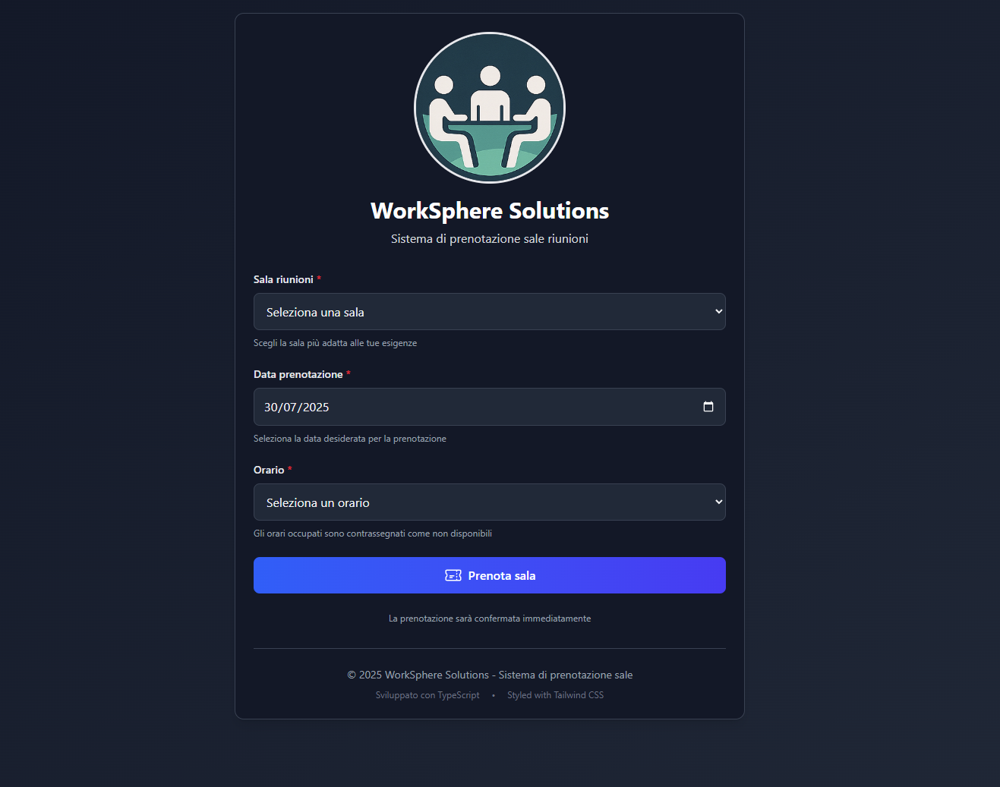

# WorkSphere Booking System

Professional meeting room booking system developed with **TypeScript 5.8.3** and **Tailwind CSS 4.1.11**.

📄 Italian version: 🇮🇹 [Italiano](README.it.md)



## Main Features

### Core Features
- **Complete Booking System**: Manage rooms, dates, and times with real-time validation
- **Conflict Prevention**: Automatic availability check and prevention of double bookings
- **Data Persistence**: Local storage with versioning and automatic migration
- **Multi-level Validation**: Client-side and service-side with detailed error messages
- **Responsive UI**: Mobile-first design with smooth animations and visual feedback

### Advanced Features
- **TypeScript Strict Mode**: Strict typing for maximum code safety
- **Modular Architecture**: Clear separation between presentation, application, and service layers
- **Optimized Performance**: Debouncing, memory management, and efficient updates
- **Advanced Error Handling**: Classified error system with structured logging
- **Full Accessibility**: ARIA labels, keyboard navigation, optimal contrast ratio

## System Architecture

### Technology Stack
```
Frontend Framework: Vanilla TypeScript + DOM APIs
CSS Framework: Tailwind CSS 4.1.11 (PostCSS Plugin)
Build Tools: TypeScript Compiler + PostCSS
Module System: ES2020 Modules
Storage: Browser LocalStorage with versioning
```

### Project Structure
```
worksphere-booking/
├── src/                          # TypeScript source code
│   ├── types/                    # Type definitions and interfaces
│   │   └── index.ts             # Core application types
│   ├── services/                 # Business logic and data layer
│   │   └── bookingService.ts    # Booking management and storage
│   ├── app.ts                   # Application layer and DOM management
│   └── input.css                # Tailwind CSS entry point
├── dist/                        # Compiled output
│   ├── types/                   # TypeScript declaration files
│   ├── services/                # Compiled service layer
│   ├── app.js                   # Main application
│   └── output.css               # Tailwind-generated CSS
├── index.html                   # Main page
├── package.json                 # Project configuration and dependencies
├── tsconfig.json                # Strict TypeScript configuration
├── tailwind.config.js           # Custom Tailwind configuration
└── postcss.config.js            # PostCSS configuration
```

## Installation & Setup

### Prerequisites
- **Node.js** >= 18.0.0
- **npm** >= 9.0.0
- Editor with TypeScript support (VS Code recommended)

### Quick Installation
```bash
# Clone and enter the project
git clone <repository-url>
cd worksphere-booking

# Install dependencies
npm install

# Full project build
npm run build

# Start development server
npm start
```

### Setup from Scratch
```bash
# Create project directory
mkdir worksphere-booking && cd worksphere-booking

# Initialize npm project
npm init -y

# Install main dependencies
npm install --save-dev typescript@^5.8.3
npm install --save-dev tailwindcss@^4.1.11 @tailwindcss/postcss@^4.1.11
npm install --save-dev postcss@^8.5.6 postcss-cli@^11.0.0 autoprefixer@^10.4.21

# Create directory structure
mkdir -p src/{types,services} dist

# Copy configuration files from the repository
# tsconfig.json, tailwind.config.js, postcss.config.js
```

## Development Commands

### Build and Compile
```bash
npm run build          # Full build (TypeScript + CSS)
npm run build:ts       # TypeScript compilation only  
npm run build:css      # Tailwind CSS generation only
```

### Development Mode
```bash
npm run dev            # Watch mode for TS and CSS simultaneously
npm run watch          # TypeScript watch mode only
npm run watch:css      # CSS watch mode only
```

### Utilities
```bash
npm run clean          # Clean dist/ directory
npm run lint           # Type checking without compilation
npm start              # Build + local static server
```

## 📋 Detailed Implementation

### 1. TypeScript Type System

#### Core Interfaces
```typescript
interface Room {
  id: number;
  name: string;
  capacity?: number;        // Optional capacity for extensibility
  amenities?: string[];     // Available amenities
}

interface Booking {
  id?: string;              // Automatically generated
  roomId: number;
  date: string;             // Format: YYYY-MM-DD
  time: string;             // Format: HH:MM
  duration?: number;        // Duration in minutes (default: 60)
  bookedBy?: string;        // Booking user
  createdAt?: Date;         // Creation timestamp
}

interface AppState {
  rooms: Room[];
  bookings: Booking[];
  selectedRoom: number | null;
  selectedDate: string | null;
  selectedTime: string | null;
}
```

#### Enums for Type Safety
```typescript
enum MessageType {
  SUCCESS = 'success',
  ERROR = 'error',
  WARNING = 'warning',
  INFO = 'info'
}

enum TimeSlot {
  SLOT_09_00 = '09:00',
  SLOT_10_00 = '10:00',
  // ... other time slots
}
```

### 2. Service Layer Architecture

#### Promise-Based Pattern
```typescript
export const saveBooking = (booking: Booking): Promise<Booking> => {
  return new Promise((resolve, reject) => {
    try {
      // Multi-level validation
      const validation = validateBooking(booking);
      if (!validation.isValid) {
        reject(new Error(`Validation failed: ${validation.errors.join(', ')}`));
        return;
      }

      // Availability check
      if (!isSlotAvailable(booking.roomId, booking.date, booking.time)) {
        reject(new Error('Selected time slot is no longer available'));
        return;
      }

      // Create booking with metadata
      const newBooking: Booking = {
        ...booking,
        id: generateBookingId(),
        createdAt: new Date(),
        duration: booking.duration || 60
      };

      // Persist to storage
      const bookings = getBookings();
      bookings.push(newBooking);
      localStorage.setItem(BOOKINGS_KEY, JSON.stringify(bookings));
      
      resolve(newBooking);
    } catch (error) {
      console.error('Error saving booking:', error);
      reject(new Error('Failed to save booking. Please try again.'));
    }
  });
};
```

#### Advanced Validation
```typescript
const validateBooking = (booking: Booking): BookingValidationResult => {
  const errors: string[] = [];

  // Room ID validation
  if (!booking.roomId || booking.roomId <= 0) {
    errors.push('Room ID must be a positive number');
  }

  // Date format validation
  if (!booking.date || !/^\d{4}-\d{2}-\d{2}$/.test(booking.date)) {
    errors.push('Date must be in YYYY-MM-DD format');
  }

  // Time format validation
  if (!booking.time || !/^\d{2}:\d{2}$/.test(booking.time)) {
    errors.push('Time must be in HH:MM format');
  }

  // Past date check
  const bookingDate = new Date(booking.date);
  const today = new Date();
  today.setHours(0, 0, 0, 0);
  
  if (bookingDate < today) {
    errors.push('Cannot book dates in the past');
  }

  return { isValid: errors.length === 0, errors };
};
```

### 3. Application Layer Pattern

#### Centralized State Management
```typescript
const appState: AppState = {
  rooms: [
    { id: 1, name: "Sala Alfa", capacity: 8 },
    { id: 2, name: "Sala Beta", capacity: 12 },
    { id: 3, name: "Sala Gamma", capacity: 6 },
  ],
  bookings: [],
  selectedRoom: null,
  selectedDate: null,
  selectedTime: null
};
```

#### Debouncing for Performance
```typescript
const debounce = <T extends (...args: any[]) => any>(
  func: T,
  delay: number
): ((...args: Parameters<T>) => void) => {
  let timeoutId: NodeJS.Timeout;
  return (...args: Parameters<T>) => {
    clearTimeout(timeoutId);
    timeoutId = setTimeout(() => func(...args), delay);
  };
};

// Usage: debounced availability updates at 300ms
const debouncedUpdate = debounce(updateAvailableTimeSlots, 300);
```

#### Type-Safe DOM Management
```typescript
interface DOMElements {
  roomSelect: HTMLSelectElement | null;
  dateInput: HTMLInputElement | null;
  timeSelect: HTMLSelectElement | null;
  bookingForm: HTMLFormElement | null;
  message: HTMLDivElement | null;
}

const initializeDOMElements = (): boolean => {
  // Type assertions with validation
  elements = {
    roomSelect: document.getElementById("room") as HTMLSelectElement,
    dateInput: document.getElementById("date") as HTMLInputElement,
    // ... other elements
  };

  // Validate element existence
  const missingElements = Object.entries(elements)
    .filter(([, element]) => !element)
    .map(([key]) => key);

  return missingElements.length === 0;
};
```

### 4. Tailwind CSS 4 Implementation

#### PostCSS Plugin Configuration
```javascript
// postcss.config.js
module.exports = {
  plugins: {
    '@tailwindcss/postcss': {}, // New Tailwind 4 plugin approach
    autoprefixer: {},
  },
}
```

#### Custom Configuration
```javascript
// tailwind.config.js
module.exports = {
  content: ["./src/**/*.{html,js,ts,jsx,tsx}", "./index.html"],
  theme: {
    extend: {
      fontFamily: {
        'sans': ['Inter', 'system-ui', 'sans-serif'],
      },
      animation: {
        'fade-in': 'fadeIn 0.5s ease-in-out',
        'slide-up': 'slideUp 0.3s ease-out',
      },
      keyframes: {
        fadeIn: {
          '0%': { opacity: '0' },
          '100%': { opacity: '1' },
        },
        slideUp: {
          '0%': { transform: 'translateY(10px)', opacity: '0' },
          '100%': { transform: 'translateY(0)', opacity: '1' },
        }
      }
    },
  },
}
```

#### Design System Components
```html
<!-- Button Primary Pattern -->
<button class="
  w-full 
  bg-gradient-to-r from-blue-600 to-indigo-600 
  hover:from-blue-700 hover:to-indigo-700 
  text-white font-semibold py-3 px-6 rounded-lg 
  focus:outline-none focus:ring-2 focus:ring-blue-500 focus:ring-offset-2 
  transition-all duration-200 
  disabled:opacity-50 disabled:cursor-not-allowed 
  transform hover:scale-[1.02] active:scale-[0.98]
">

<!-- Form Input Pattern -->
<input class="
  w-full p-3 
  border border-gray-300 rounded-lg 
  focus:ring-2 focus:ring-blue-500 focus:border-blue-500 
  transition-colors duration-200 
  disabled:bg-gray-100 disabled:cursor-not-allowed
">
```

## Advanced Features

### Systemic Error Handling
```typescript
// Custom error classification
class ValidationError extends Error {
  constructor(message: string, public context?: any) {
    super(message);
    this.name = 'ValidationError';
  }
}

class BookingConflictError extends Error {
  constructor(message: string, public context?: any) {
    super(message);
    this.name = 'BookingConflictError';
  }
}

// Global error boundary
window.addEventListener('error', (event) => {
  console.error('Global application error:', event.error);
  showMessage('An unexpected error occurred', MessageType.ERROR);
});
```

### Storage with Versioning
```typescript
const STORAGE_VERSION = '1.0';
const VERSION_KEY = 'roomBookingsVersion';

const initializeStorage = (): void => {
  const currentVersion = localStorage.getItem(VERSION_KEY);
  
  if (currentVersion !== STORAGE_VERSION) {
    // Data migration logic if necessary
    localStorage.setItem(VERSION_KEY, STORAGE_VERSION);
  }
};
```

### Performance Monitoring
```typescript
// Basic performance metrics
const performanceLogger = {
  startTime: performance.now(),
  
  logOperation: (operation: string, startTime: number) => {
    const duration = performance.now() - startTime;
    if (duration > 100) { // Log operations > 100ms
      console.warn(`Slow operation: ${operation} took ${duration.toFixed(2)}ms`);
    }
  }
};
```

## UI/UX Features

### Dynamic Messaging System
- Success/error/warning/info messages with differentiated colors
- Auto-hide after 5 seconds with slide-up animation
- Context-aware error messages for better UX

### Responsive Design Strategy
- Mobile-first approach with `md:`, `lg:`, `xl:` breakpoints
- Responsive typography scale
- Touch-friendly interactions on mobile

### Accessibility Compliance
- ARIA labels and semantic HTML
- Focus management for keyboard navigation
- Color contrast ratio > 4.5:1 for WCAG compliance
- Screen reader friendly error announcements

## Browser Support & Performance

### Browser Compatibility
- **Chrome/Edge** >= 88 (ES2020 support)
- **Firefox** >= 85
- **Safari** >= 14
- **Mobile browsers** with ES2020 support

### Performance Metrics
- **First Contentful Paint** < 1.5s
- **Largest Contentful Paint** < 2.5s
- **Bundle size** < 50KB (CSS + JS minified)
- **Memory usage** < 10MB runtime

## Testing Strategy

### Testing Approach (Theory)
```typescript
// Unit testing approach
describe('BookingService', () => {
  test('should save valid booking', async () => {
    const booking = { roomId: 1, date: '2024-01-01', time: '09:00' };
    const saved = await saveBooking(booking);
    expect(saved.id).toBeDefined();
  });

  test('should reject invalid booking', async () => {
    const booking = { roomId: 0, date: '', time: '' };
    await expect(saveBooking(booking)).rejects.toThrow();
  });
});

// Integration testing approach  
describe('Booking Flow', () => {
  test('should prevent double booking', async () => {
    const booking = { roomId: 1, date: '2024-01-01', time: '09:00' };
    await saveBooking(booking);
    await expect(saveBooking(booking)).rejects.toThrow('already booked');
  });
});
```

## Security Considerations

### Input Validation
- User input sanitization to prevent XSS
- Strict date/time format validation with regex
- TypeScript type safety as first defense

### Data Protection
- localStorage isolation per origin
- No sensitive data stored on client
- Error messages do not expose internals

## Deployment & Production

### Production Build
```bash
# Clean build
npm run clean
npm run build

# Check output
ls -la dist/
du -h dist/*

# Local production test
npm start
```

### Production Optimizations
- Automatic CSS purging via Tailwind
- Optimized TypeScript compilation
- Source maps for debugging
- Minification via PostCSS

## Future Roadmap

### Planned Features
- [ ] **Testing Suite**: Jest + Testing Library + Playwright E2E
- [ ] **PWA Support**: Service workers, offline mode, installability
- [ ] **Backend Integration**: REST API, authentication, multi-device sync
- [ ] **Advanced Booking**: Recurring bookings, email notifications, calendar sync
- [ ] **Analytics**: Usage tracking, performance monitoring
- [ ] **Internationalization**: Multi-language support

### Technical Improvements
- [ ] **Bundle Optimization**: Code splitting, lazy loading
- [ ] **State Management**: Redux Toolkit for complex apps
- [ ] **Real-time Updates**: WebSocket for live updates
- [ ] **Advanced Caching**: Service worker caching strategies
- [ ] **Error Reporting**: Sentry integration for production monitoring

## Contributing

### Development Setup
1. Fork the repository
2. Local clone: `git clone <your-fork-url>`
3. Install dependencies: `npm install`
4. Setup git hooks: `npm run prepare` (if available)
5. Create feature branch: `git checkout -b feature/feature-name`

### Code Standards
- **TypeScript strict mode** required
- **Prettier** for code formatting
- **ESLint** for code quality
- **Conventional Commits** for git messages
- **Comments in English** even for Italian codebase

### Pull Request Process
1. Ensure build passes: `npm run build`
2. Type checking: `npm run lint`
3. Complete manual test
4. Update documentation if needed
5. Squash commits before merging

## License & Credits

**License**: MIT License

**Developed by**: Francesco di Biase
**Technologies**: TypeScript, Tailwind CSS 4, PostCSS
**Support**: Complete documentation and community support

---

*This project represents an example of best practices for modern TypeScript applications, focusing on type safety, performance, and user experience.*
